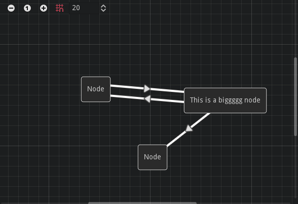

# Fractural Flowchart 🌊

A Godot addon that adds a custom flowchart node similar to graph edit except made up of nodes that can have connections to multiple other nodes. 
This can be used to make state machine editors, such as the editor found in [FracturalFSM](https://github.com/Fractural/FracturalFSM).

This is a modified C# port of imjp94's FlowChart node in [gd-YAFSM](https://github.com/imjp94/gd-YAFSM).

A Flowchart is a control that can display a flow chart like graph. It can store multiple layers called FlowchartLayers. 
A FlowchartLayer contains FlowchartNodes and FlowchartLines.

Flowcharts are simple directed graphs, which means
- Connection `A -> B` is different from `B -> A`
- There are no parallel edges (There cannot be multiple connections from `A -> B`)
- There are no self-loops (There are no edges like `A -> A`)




## FlowchartNode

FlowchartNode is a node that can be added to the flow chart. Nodes are selectable.

## FlowchartLine

FlowchartLine is the displayed line that connects FlowchartNodes together.

## FlowchartLayer

FlowchartLayer stores a group of nodes and lines. Connections between nodes are represented by the `Connection` class. Connections can also be represented by just the name of the two connected nodes, stored in the `ConnectionPair` struct.

## Flowchart

A Flowchart control that displays the flow chart. To make your own Flowchart, make a new C# class that extends Flowchart.

### Prefab Creation

To make the flowchart use your own implementation of flowchart layers/flowchart lines, you can override the prefab creation methods to return your own instances.

```CSharp
protected virtual FlowchartLayer CreateLayerInstance();
protected virtual FlowchartLine CreateLineInstance();
```

### Lifecycle Methods

Flowchart also contains virtual methods for various different events, letting you easily override them to extend functionality.

```CSharp
protected virtual void OnLayerSelected(FlowchartLayer layer);
protected virtual void OnLayerDeselected(FlowchartLayer layer);
protected virtual void OnNodeAdded(FlowchartLayer layer, Control node);
protected virtual void OnNodeRemoved(FlowchartLayer layer, Control node);
protected virtual void OnNodeDragged(FlowchartLayer layer, Control node, Vector2; netDragDelta);
protected virtual void OnNodeConnected(FlowchartLayer layer, string from, string to);
protected virtual void OnNodeDisconnected(FlowchartLayer layer, string from, string to);
protected virtual void OnNodeConnectFailed(FlowchartLayer layer, string from);
protected virtual void OnNodeReconnectBegin(FlowchartLayer layer, string from, string to);
protected virtual void OnNodeReconnectEnd(FlowchartLayer layer, string from, string to);
protected virtual void OnNodeReconnectFailed(FlowchartLayer layer, string from, string to);
protected virtual bool RequestConnectFrom(FlowchartLayer layer, string from);
protected virtual bool RequestConnectTo(FlowchartLayer layer, string to);
protected virtual void OnDuplicated(FlowchartLayer layer, GDC.Array<Control> oldNodes, GDC.Array<Control> newNodes);
```
